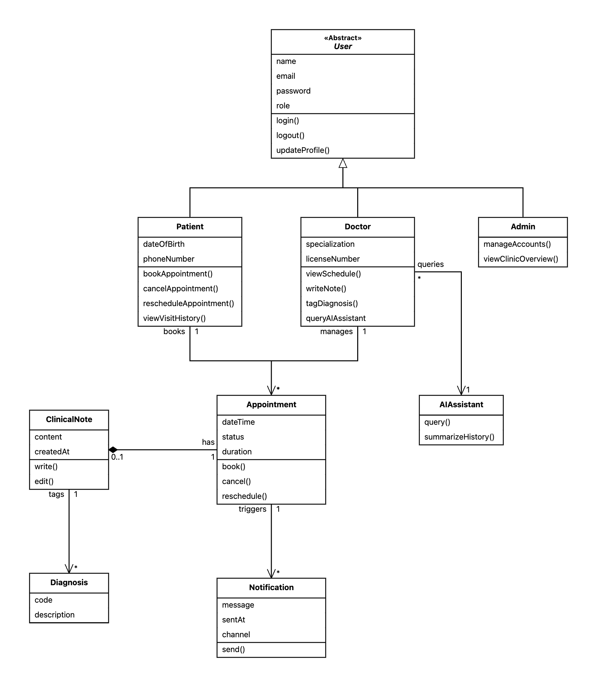
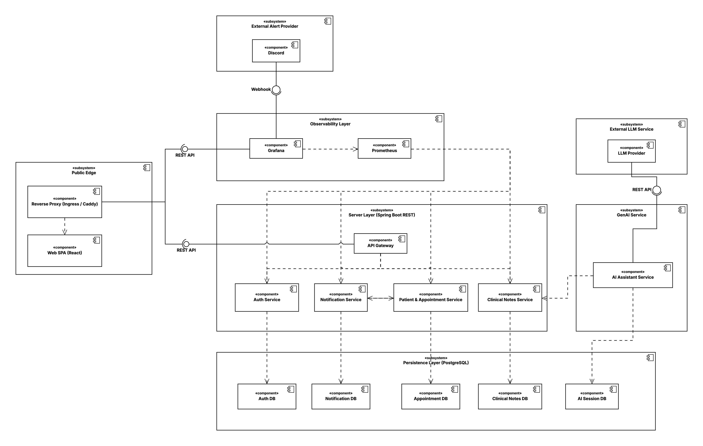
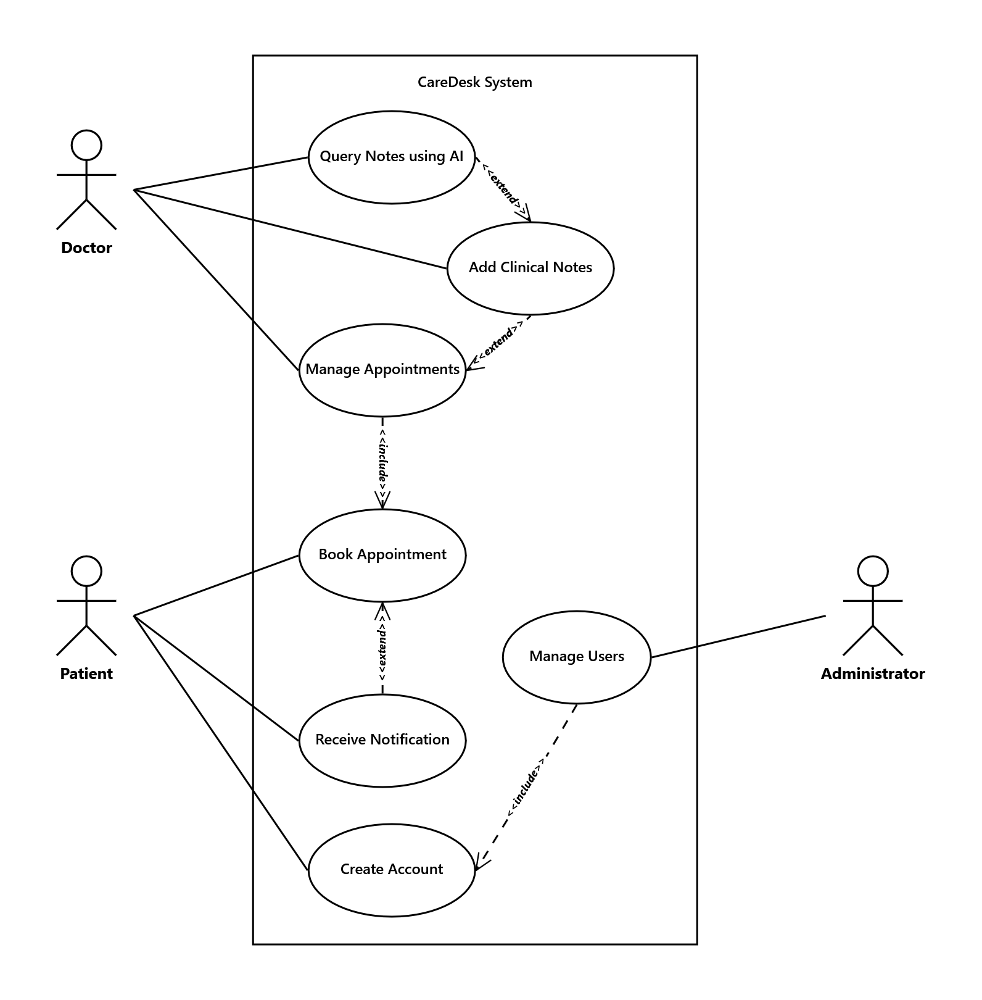

# 📖 Glossary — CareDesk

> Derived from the Problem Statement using **Abbott's Technique**.
> Nouns → Classes, Verbs → Operations, Adjectives → Attributes.

---

## Abbott's Technique Applied to CareDesk

**Problem Statement (user stories):**

- As a **patient**, I want to *register* and manage my **profile** so that I can access the platform.
- As a **patient**, I want to *book*, *reschedule*, and *cancel* **appointments** so that I can visit my preferred **doctor**.
- As a **patient**, I want to *view* my **visit history** so that I can track my past consultations.
- As a **doctor**, I want to *view* my **schedule** so that I can see my upcoming **appointments**.
- As a **doctor**, I want to *write* structured **clinical notes** for each **visit** so that I can document diagnoses and treatments.
- As a **doctor**, I want to *tag* a **diagnosis** on a **visit note** so that patient history is structured and searchable.
- As a **doctor**, I want to *query* patient history using the **AI assistant** so that I can retrieve summaries quickly.
- As an **admin**, I want to *manage* **user accounts** so that I can control access to the platform.
- As a **patient**, I want to *receive* **notifications** for upcoming appointments so that I don't miss them.
- As the **system**, I want to *send* automated **reminders** before each **appointment** so that no-show rates are reduced.

---

## Identified Entities (Nouns → Classes)

| Grammatical Construct | Term | UML Element |
|---|---|---|
| Improper noun | Patient | Class |
| Improper noun | Doctor | Class |
| Improper noun | Admin | Class |
| Improper noun | User | Class (parent of Patient, Doctor, Admin) |
| Improper noun | Appointment | Class |
| Improper noun | ClinicalNote | Class |
| Improper noun | Diagnosis | Class |
| Improper noun | Notification | Class |
| Improper noun | AIAssistant | Class |
| Improper noun | Schedule | Class |

---

## Identified Operations (Verbs → Operations)

| Verb | Operation | Belongs To |
|---|---|---|
| register | register() | Patient |
| book | bookAppointment() | Patient |
| reschedule | rescheduleAppointment() | Patient |
| cancel | cancelAppointment() | Patient |
| view | viewHistory(), viewSchedule() | Patient, Doctor |
| write | writeNote() | Doctor |
| tag | tagDiagnosis() | Doctor |
| query | queryPatientHistory() | AIAssistant |
| send | sendReminder() | Notification |
| manage | manageAccount() | Admin |

---

## Glossary Table

| Entity | Description |
|---|---|
| **User** | The base entity for all people who access CareDesk. Has a role (Patient, Doctor, or Admin), login credentials, and personal details. Can register and log in. |
| **Patient** | A registered user who seeks medical care. Can book and manage appointments, view their visit history, and receive notifications. Has a profile with personal and medical information. |
| **Doctor** | A registered user who provides medical care. Manages their own schedule, writes clinical notes after consultations, and can use the AI assistant to query patient history. |
| **Admin** | A privileged user who oversees the platform. Can manage user accounts, monitor clinic activity, and ensure system integrity. |
| **Appointment** | A scheduled meeting between a Patient and a Doctor at a specific date and time. Can be booked, rescheduled, or cancelled. Has a status (upcoming, completed, cancelled). |
| **Schedule** | A Doctor's time-based view of their upcoming appointments. Reflects available and booked time slots. Used by patients to find available slots and by doctors to plan their day. |
| **ClinicalNote** | A structured record written by a Doctor after a patient visit. Contains consultation findings, treatment plans, and is linked to a specific Appointment. Contributes to the patient's visit history. |
| **Diagnosis** | A medical classification tag attached to a ClinicalNote. Categorises the condition identified during a visit. Enables structured querying of patient history. |
| **VisitHistory** | The complete collection of a Patient's past appointments and associated clinical notes. Readable by the patient and queryable by the doctor via the AI assistant. |
| **Notification** | An automated message sent to a Patient before an upcoming Appointment. Can be delivered via email or SMS. Triggered by the system based on appointment time. |
| **AIAssistant** | A RAG-based intelligent component available to Doctors. Accepts natural language queries and retrieves grounded answers from patient data and medical guidelines. Does not operate independently of a user query. |

## Analysis Object Model

## Top Level Architecture

## Use Case Diagram

