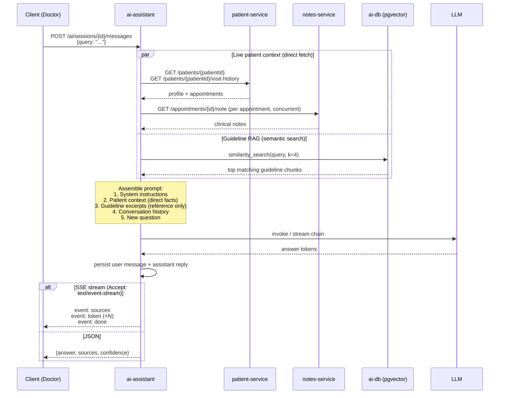

# AI Assistant Service

FastAPI service for the AI assistant. It manages persistent conversation **sessions**: each session is owned by a user, optionally bound to a patient/appointment, and stores the full message history. Every message turn re-fetches live patient/appointment context and replays the prior conversation to the configured LLM, returning an OpenAPI-shaped response (with optional Server-Sent Events streaming).

Sessions and the clinical-guidelines vector collection are stored in `ai-db`, a Postgres instance running the `pgvector` extension.

## Query workflow

When a doctor sends a message, two parallel retrieval paths run before the LLM is called:



### What each retrieval path contributes

| Path | Source | What it fetches | How it's used in the prompt |
|---|---|---|---|
| **Patient context** | patient-service + notes-service | Profile, appointments, clinical notes | Injected directly as authoritative facts |
| **Guideline RAG** | ai-db pgvector collection | Top-4 semantically matching chunks from `data/guidelines/*.md` | Injected as general reference; LLM is told not to override patient facts with them |

The two paths are independent: a session with no patient bound skips the live fetch entirely and the LLM answers as a general medical reference, still enriched by guidelines.

### Guideline knowledge base

The `clinical_guidelines` pgvector collection is populated by `scripts/ingest_guidelines.py`, which runs once at stack startup (as a Docker Compose one-shot service or a Kubernetes post-install Job). It reads every `*.md` file under `data/guidelines/`, splits them into ~1000-character chunks, embeds them via the configured embedding model, and writes the vectors to `ai-db`. Retrieval at query time uses cosine similarity; hits beyond a distance threshold (`GUIDELINES_MAX_DISTANCE`, default `0.55`) are dropped so off-topic queries pull in no noise.

## Project Structure

```text
services/ai-assistant/
├── main.py              # FastAPI app entry point (creates tables on startup)
├── routes/
│   ├── health.py        # Health endpoint
│   └── sessions.py      # /ai/sessions* endpoints
├── db/
│   ├── engine.py        # Async SQLAlchemy engine + get_db dependency
│   ├── orm.py           # ConversationSession / ConversationMessage tables
│   └── repository.py    # Owner-scoped CRUD helpers
├── models/              # Generated request/response models
├── utils/
│   ├── llm.py           # LLM provider selection and caching
│   ├── embeddings.py    # Embedding model config (mirrors llm.py)
│   ├── context.py       # Live patient/appointment grounding (direct HTTP fetch)
│   ├── guidelines.py    # Guideline RAG retrieval from pgvector
│   └── prompt_templates.py
├── scripts/
│   └── ingest_guidelines.py  # One-off: chunk + embed + load data/guidelines/ into pgvector
├── data/
│   └── guidelines/      # Curated clinical guideline markdown files
├── tests/               # Unit tests
├── Dockerfile
├── requirements.txt
└── .env.example
```

## Configuration

Create `services/ai-assistant/.env` from `.env.example` if you want to override the defaults.

Useful variables:

- `LLM_PROVIDER` — `openai` or `openwebui`
- `LLM_API_KEY` — OpenAI key, or `ollama` for local Ollama
- `LLM_MODEL` — e.g. `gpt-4o-mini` or `llama3.2`
- `OPENWEBUI_BASE_URL` — required when `LLM_PROVIDER=openwebui`
- `EMBEDDING_MODEL` — model used to embed guidelines (default: `text-embedding-3-small` for openai, `nomic-embed-text` for openwebui)
- `EMBEDDING_DIM` — must match the model (1536 for `text-embedding-3-small`, 768 for `nomic-embed-text`)
- `DB_HOST` / `DB_PORT` / `DB_NAME` / `DB_USER` / `DB_PASSWORD` — pgvector DB for sessions + guideline vectors (or `DATABASE_URL` for a full DSN)
- `GUIDELINES_TOP_K` — max guideline chunks returned per query (default: 4)
- `GUIDELINES_MAX_DISTANCE` — cosine distance cutoff; hits beyond this are dropped (default: 0.55)

## Run Locally

```bash
cd services/ai-assistant
python main.py
```

Or with Docker:

```bash
docker compose up
```

## Endpoints

- `GET /ai/health`
- `POST /ai/sessions` — start a conversation (optionally bound to a patient/appointment)
- `GET /ai/sessions` — list the caller's sessions
- `GET /ai/sessions/{sessionId}` — fetch a session with its messages
- `DELETE /ai/sessions/{sessionId}` — delete a session
- `POST /ai/sessions/{sessionId}/messages` — send a message and get the reply

Identity headers (`X-User-Id`, `X-User-Role`) are injected by the gateway; only `DOCTOR`/`ADMIN` may use the assistant, and sessions are scoped to their owner.

Example: start a session, then ask a question (the `X-User-*` headers are normally set by the gateway):

```bash
SID=$(curl -s -X POST http://localhost:8000/ai/sessions \
  -H "Content-Type: application/json" \
  -H "X-User-Role: DOCTOR" -H "X-User-Id: 11111111-1111-1111-1111-111111111111" \
  -d '{"patientId": "550e8400-e29b-41d4-a716-446655440000"}' | jq -r .id)

curl -X POST http://localhost:8000/ai/sessions/$SID/messages \
  -H "Content-Type: application/json" \
  -H "X-User-Role: DOCTOR" -H "X-User-Id: 11111111-1111-1111-1111-111111111111" \
  -d '{"query": "Give me a short summary of this patient."}'
```

Add `-H "Accept: text/event-stream"` to the message request to stream the answer token by token.

## Testing

```bash
cd services/ai-assistant
./run_tests.sh
```
